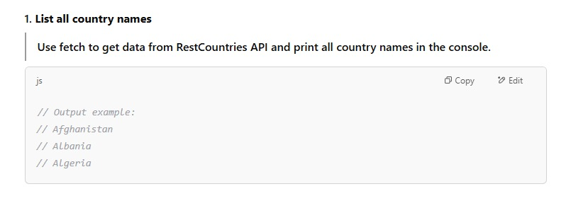
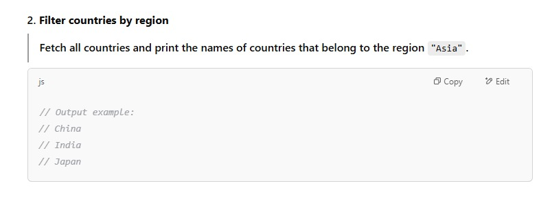
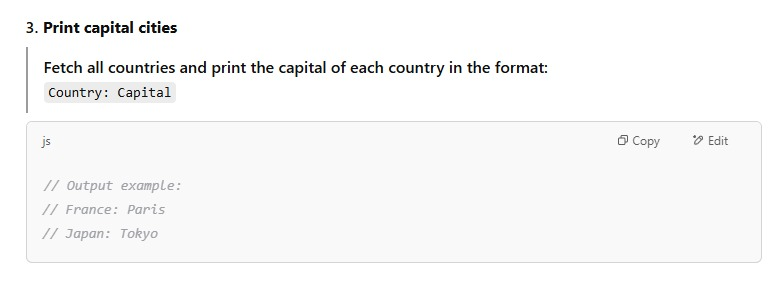
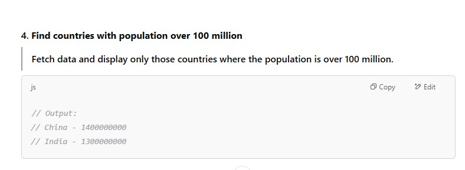
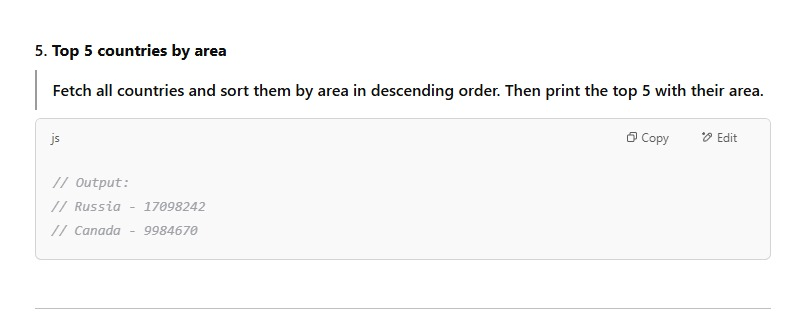
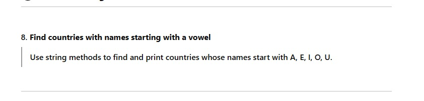

<h1>TASK # 01 API with Promises and Async/Await in pure JS</h1>

<h3>Normal Version with Promises</h3><a  href="task1.js"> Normal Version </a>

<h1>TASK # 02 API with Promises and Async/Await in pure JS</h1>

<h3>Normal Version with Promises</h3><a  href="task2.js"> Normal Version </a>

<h1>TASK # 03 API with Promises and Async/Await in pure JS</h1>

<h3>Normal Version with Promises</h3><a  href="task3.htm"> Normal Version </a>

<h1>TASK # 04 API with Promises and Async/Await in pure JS</h1>

<h3>Normal Version with Promises</h3><a  href="task4.htm"> Normal Version </a>

<h1>TASK # 05 API with Promises and Async/Await in pure JS</h1>

<h3>Normal Version with Promises</h3><a  href="task5.htm"> Normal Version </a>

<h1>TASK # 08 API with Promises and Async/Await in pure JS</h1>

<h3>Normal Version with Promises</h3><a  href="task8.htm"> Normal Version </a>

<h3>Better Version</h3><a href="task8bt.html" >Better Optimized Version</a>

<h3>Normal Version with Asyn/Await</h3><a  href="task8aa.html"> With Async/Await </a>

 

<h1>TASK # 03 Countries with Name and Capital in console</h1>

<h3>Normal Version with Promises</h3><a  href="task3.html"> Normal Version </a>

 
<a href="https://hmftj.com">For more feel free to conatct us!!!</a>

